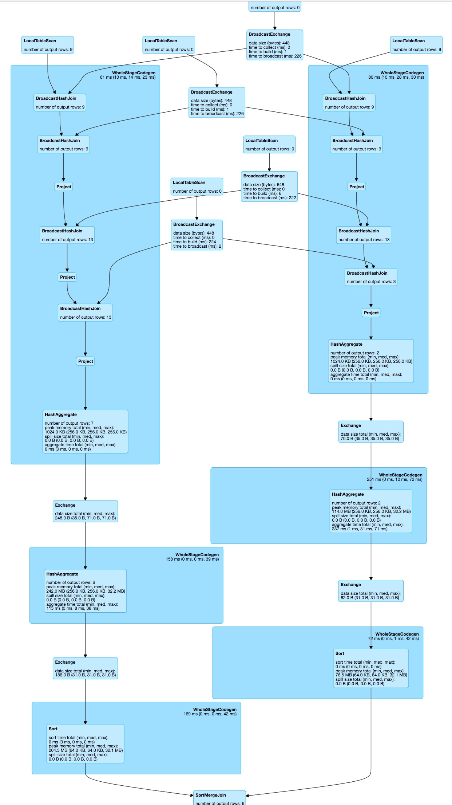
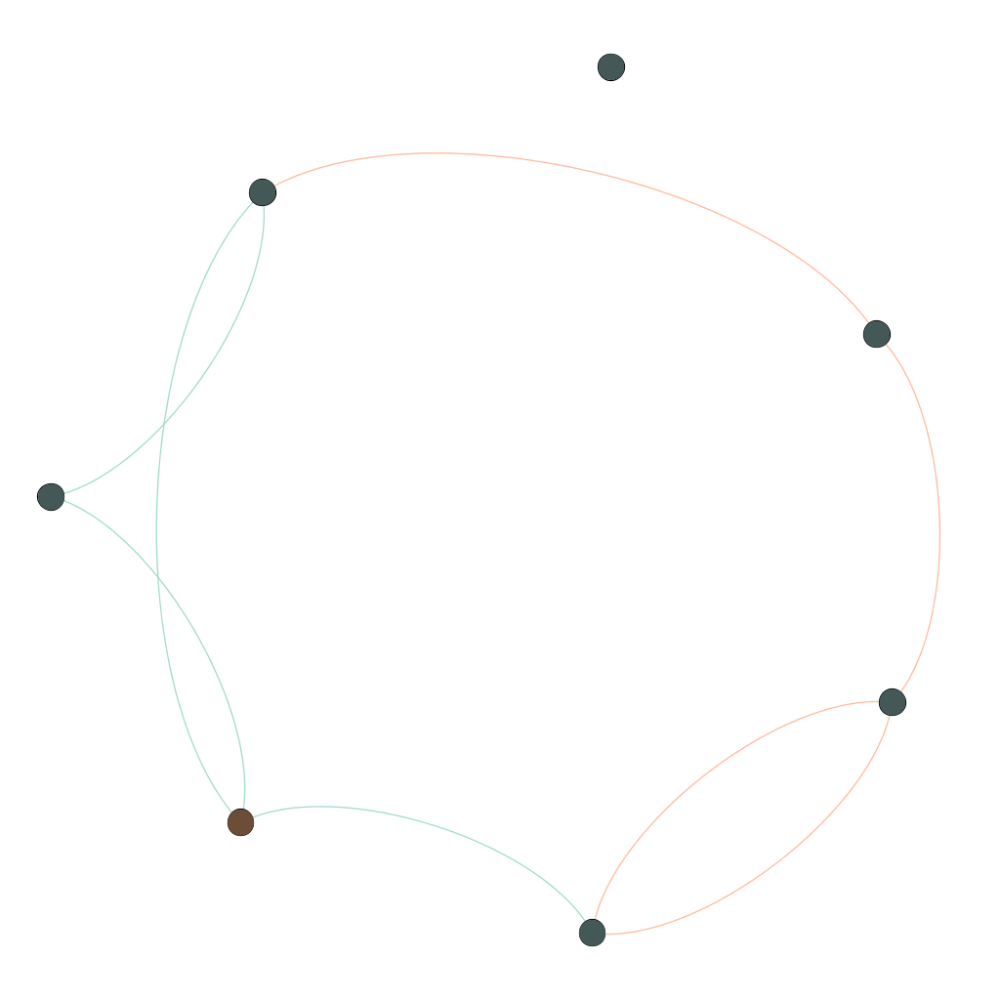

# getting started with graph-frames
Mini project to get me started with graph-frames.
I want to compute several metrics for each node.

For each node compute percentage of fraudulent connections for 
  - direct node (directed)
  - direct node (undirected)
  - the friendship network from the node (directed)
  - the friendship network from the node (undirected)
in total and per connection type.

Getting started with graph-frames I am not sure how to move forward. Looking forward to some suggestions.

The following nodes are present:

```
---+---------+-----+
| id|     name|fraud|
+---+---------+-----+
|  a|    Alice|    1|
|  b|      Bob|    0|
....
|  f|    Fanny|    0|
|  g|    Gabby|    0|
|  h|Fraudster|    1|
+---+---------+-----+
```

and edges
```
+---+---+------------+
|src|dst|relationship|
+---+---+------------+
|  a|  b|        call|
|  b|  c|         sms|
....
|  a|  h|        call|
|  f|  h|        call|
+---+---+------------+
```


## direct friends

> TODO check: I did not cache the graph but still make sure spark is not caching the results, 
> otherwise comparing them one after the other has no meaning

**naive calculation**

Using a naive method (join) the calculation can be performed.
It takes around 4 seconds on my MacBook. It is measured including the `df.show` statement, but still even if it takes one
second for this amount of vertices, that is very slow.

But:
> this is a false friend. This method will ignore vertices not present as outgoing.

**improved calculation**

Using sparks RDD API and a statCounter can speed up the computation by a lot. Now it takes only 007 seconds.
For such a small graph the DAG does not really look simpler. But the timing shows the advantage.
 

**naive method with different types of edges**



**improved method with different types of edges**


**pregel API: Message passing via AggregateMessages**

### ongoing discussions

  - http://stackoverflow.com/questions/41946947/spark-graphframes-stateful-motif
  - http://stackoverflow.com/questions/41908966/spark-graph-efficient-joins
  - https://forums.manning.com/posts/list/39971.page
  - https://forums.manning.com/posts/list/40095.page

### some graph-frames tutorials

  - http://graphframes.github.io/user-guide.html
  - https://www.mapr.com/blog/using-spark-graphframes-analyze-facebook-connections
  - https://www.mapr.com/blog/how-get-started-using-apache-spark-graphx-scala
  - https://www.youtube.com/watch?v=zx9KI3DsZss
  
### cool libraries
  - https://github.com/sparkling-graph/sparkling-graph
  
## visualization
from generated graphml gephi visualization looks like


